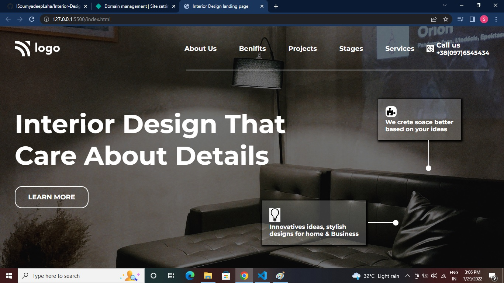

# Interior Design landing page (Project 10)

by Soumyadeep Laha

## Learnings from this project

- Learned how to blur any div using CSS rgba() method. 
- Learned how to draw line in a empty div using class and CSS border property.
- Also learned about positioning each lines and dot on the page.
- Learned how to render icons in HTML document using font awesome.
- Learned how to write and HTML document using latest HTML5 semantic elements.

## Time to complete the project

Honest time it tooked me is 2 hours. 

## Screen Shorts of the project

## Live link to the project

[Netlify Link...](https://interior-design-landing-page-proj10.netlify.app/)